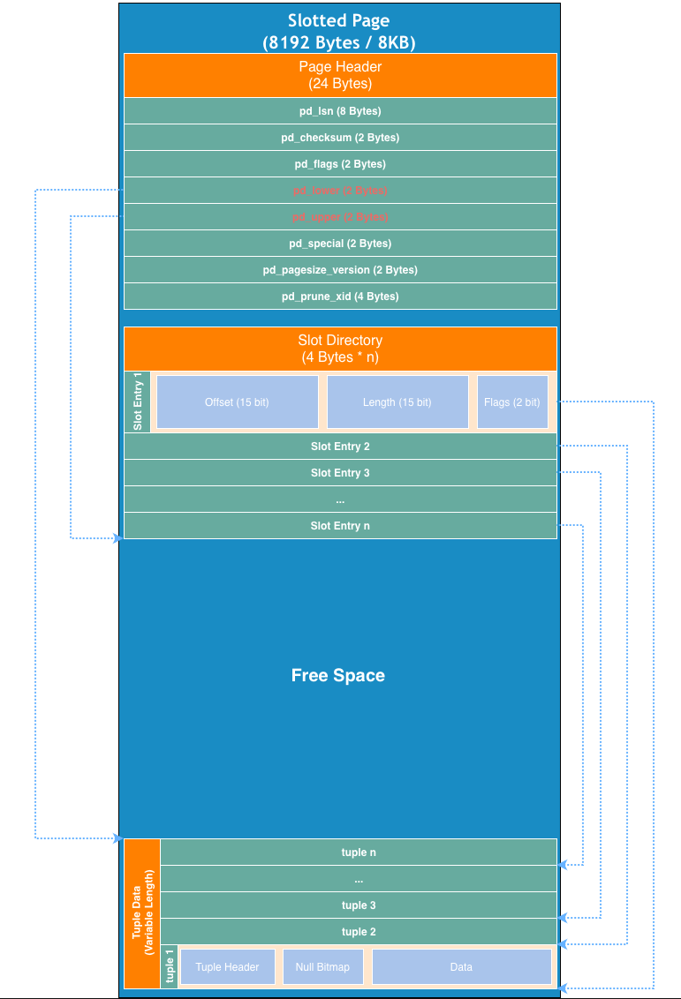

# 物理ストレージ設計仕様書 (Physical Storage Design Specification)

## 1. 概要 (Overview)
本プロジェクトのストレージエンジンは、PostgreSQLの内部構造をモデルにした **Slotted Page（スロットページ）** アルゴリズムを採用しています。この設計により、固定サイズのページ内で可変長データ（Variable-length records）を効率的に管理し、ディスクI/Oのパフォーマンスを最大化します。

---

## 2. ページレイアウト図 (Page Layout Diagram)

標準のページサイズは **8,192バイト (8KB)** です。これは PostgreSQL のデフォルト値であり、現代の SSD（特に MacBook M1 の NVMe SSD）のブロックサイズと親和性が高い設定です。



---

## 3. ページヘッダーとバイト詳細 (Byte-level Details)

| オフセット | 長さ (Bytes) | 名称           | 役割と説明 (Description)                                                             |
| :--------- | :----------- | :------------- | :----------------------------------------------------------------------------------- |
| **0**      | 8            | `pd_lsn`       | **Log Sequence Number.** ページを最後に変更したWALログの識別子。                     |
| **8**      | 2            | `pd_checksum`  | **Checksum.** 書き込み時の整合性チェック用。                                         |
| **10**     | 2            | `pd_flags`     | **Flags.** ページのステータス（空きあり、インデックス用など）。                      |
| **12**     | 2            | `pd_lower`     | **Free Space Start.** スロットディレクトリの末尾（次に追加するスロットの開始位置）。 |
| **14**     | 2            | `pd_upper`     | **Free Space End.** 元組（Tuple）データ区の开始位置。                                |
| **16**     | 2            | `pd_special`   | **Special Space.** インデックス（B-Tree）の前後ページへのポインタ等に使用。          |
| **18**     | 2            | `pd_pagesize`  | ページサイズとバージョンの識別。                                                     |
| **20**     | 4            | `pd_prune_xid` | 不要になったタプルのクリーンアップ（VACUUM）用。                                     |

---

## 4. コアロジック：双向成長 (Dual-Directional Growth)

スロットページ方式の最大の特徴は、**「ヘッダーに近い方は後ろへ、末尾に近い方は前へ」** 成長する構造です。

1. **スロットディレクトリ (Slot Directory):**
   - ページの先頭（ヘッダー直後）から下に向かって成長します。
   - 各スロットは **4バイト** で、実際のデータがページ内のどこにあるか（Offset）と、そのデータの長さ（Length）を保持します。
   - インデックスとしての役割を果たし、データの物理的な位置が変わってもスロット番号（ID）は固定されます。

2. **タプルデータ (Tuple Data):**
   - ページの末尾から上に向かって成長します。
   - 実際のレコード（Row）がバイナリ形式で格納されます。

3. **空き領域 (Free Space):**
   - `pd_lower`（スロットの末尾）と `pd_upper`（データの先端）の間のギャップです。
   - `pd_lower + 4 > pd_upper` となった時点で、そのページは「Full」と判定されます。

---

## 5. 実装上の考慮事項 (Implementation Notes)

### Java (NIO ByteBuffer)
Apple Silicon (M1) の性能を引き出すため、`java.nio.ByteBuffer` の **Direct Buffer** を使用してメモリマップドファイルに近い速度で操作します。

```java
// スロットのパック例 (Offset 15bit | Flags 2bit | Length 15bit)
int slot = (offset << 17) | (flags << 15) | (length);
buffer.putInt(lower, slot);
```

### フラグメンテーション (Fragmentation)
レコードの削除や更新によってページ内に「虫食い」状態の空きができる場合があります。本プロジェクトでは、必要に応じて **Page Reorganization（ページ再編成）** を行い、データを詰め直すことで空き領域を統合するロジックを実装します。

---

## 6. 参照 (References)
- [PostgreSQL Documentation: Database Page Layout](https://www.postgresql.org/docs/current/storage-page-layout.html)